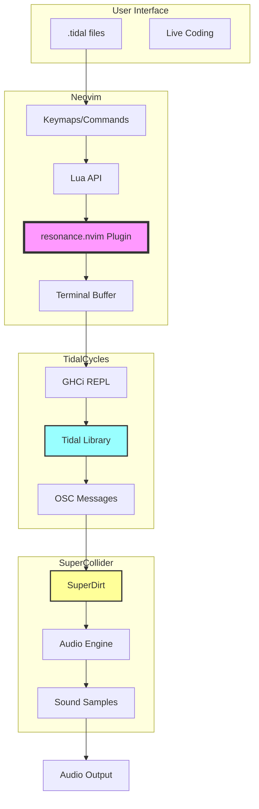
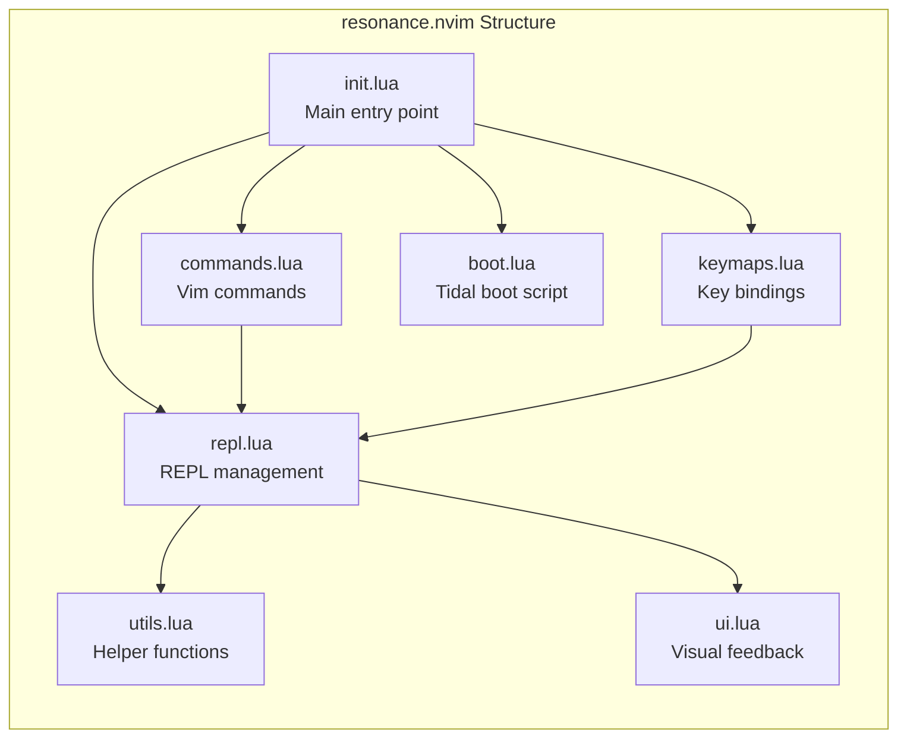
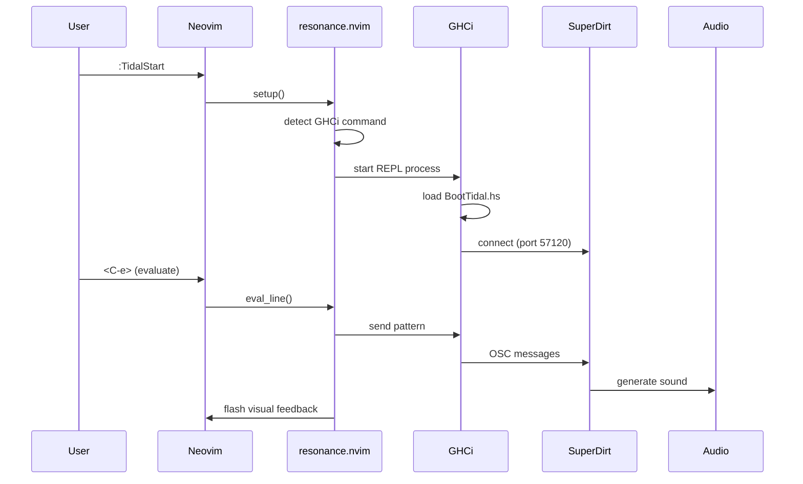

# resonance.nvim

A modern Neovim plugin for TidalCycles live coding.

## Features

- Modern Lua API
- Asynchronous REPL communication
- Built-in syntax highlighting and indentation
- Smart code evaluation (blocks, lines, patterns)
- Visual feedback for evaluated code
- Integrated documentation viewer
- Pattern visualization (planned)

## Requirements

- Neovim >= 0.8.0
- TidalCycles installed
- GHCi (via GHC or Stack)
- SuperCollider (for audio)

## Installation

Using [lazy.nvim](https://github.com/folke/lazy.nvim):

```lua
{
  "TrsNium/resonance.nvim",
  dependencies = {
    "nvim-lua/plenary.nvim",
  },
  config = function()
    require("resonance").setup()
  end,
}
```

## Usage

Basic commands:

- `:TidalStart` - Start TidalCycles REPL
- `:TidalStop` - Stop TidalCycles REPL
- `:TidalEval` - Evaluate current line/selection
- `:TidalHush` - Stop all patterns

Default keymaps:

- `<C-e>` - Evaluate current line/block
- `<leader>th` - Hush all patterns
- `<leader>ts` - Show REPL status

## Configuration

```lua
require("resonance").setup({
  -- REPL settings
  repl = {
    -- Auto-detects: stack ghci > ghci
    -- Or specify manually:
    -- cmd = "stack",
    -- args = { "exec", "--", "ghci" },
    
    -- For custom installations:
    -- cmd = "/path/to/ghci",
    -- args = {},
    
    extra_args = {}, -- Additional args after boot script
    auto_start = false,
  },
  
  -- UI settings
  ui = {
    show_eval_flash = true,
    eval_flash_duration = 150,
    floating_repl = true,
  },
  
  -- Keymaps
  keymaps = {
    eval_line = "<C-e>",
    eval_block = "<C-e>",
    hush = "<leader>th",
    toggle_repl = "<leader>tt",
  },
})
```

## Architecture



### Component Overview



### Data Flow



### Module Responsibilities

| Module | Responsibility |
|--------|---------------|
| `init.lua` | Plugin initialization, configuration management |
| `repl.lua` | Terminal buffer creation, process management |
| `commands.lua` | Vim command definitions (`:TidalStart`, etc.) |
| `keymaps.lua` | Key binding setup for .tidal files |
| `utils.lua` | GHCi detection, command building |
| `ui.lua` | Visual feedback, error messages |
| `boot.lua` | TidalCycles boot script generation |

## License

MIT
